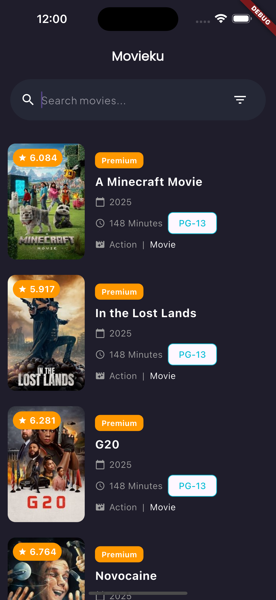

# FetchAPI TMDB API with DIO + Flutter

This Flutter project demonstrates how to fetch movie data from the [TMDB API](https://www.themoviedb.org/) using the DIO package for educational purposes.

## Screenshots



## Features

- Fetch movie data from TMDB API.
- Display movie posters, titles, and descriptions.
- Use DIO package for network requests.

## Installation

1. Clone this repository:

   ```bash
   git clone https://github.com/ahmdsk/MovieKu.git
   ```

2. Navigate to the project directory:

   ```bash
   git clone https://github.com/ahmdsk/MovieKu.git
   ```

1. Clone this repository:

   ```bash
   cd fetchapi-tmdb-dio-flutter
   ```

3. Install dependencies:

   ```bash
   flutter pub get
   ```

4. Run the app:

   ```bash
   flutter run
   ```